<div align="center">

# Entrelinhas

**Uma plataforma de blog com CMS, recursos de comunidade e RBAC/segurança pensados desde o primeiro dia — não encaixados depois de um tutorial.**

[](https://nestjs.com/)
[](https://nextjs.org/)
[](https://www.typescriptlang.org/)
[](https://www.prisma.io/)
[](https://supabase.com/)
[](https://tailwindcss.com/)
[](https://jestjs.io/)
[](LICENSE)

[🇺🇸 Read in English](README.md) · **Português (BR)**

</div>

---

## Sumário

- [Screenshots](#screenshots)
- [Por que esse projeto existe](#por-que-esse-projeto-existe)
- [O que ele realmente faz](#o-que-ele-realmente-faz)
- [Funcionalidades](#funcionalidades)
- [Stack](#stack)
- [Arquitetura](#arquitetura)
- [Decisões de engenharia que valem a pena mencionar](#decisões-de-engenharia-que-valem-a-pena-mencionar)
- [Modelo de segurança](#modelo-de-segurança)
- [Estrutura do projeto](#estrutura-do-projeto)
- [Rodando localmente](#rodando-localmente)
- [Deploy](#deploy)
- [Roadmap](#roadmap)
- [Licença](#licença)

---

## Screenshots

### Modo escuro sem flash do tema errado

A preferência salva é aplicada por um script inline antes da página hidratar — não é um efeito no cliente correndo contra a primeira renderização.


### Comentando e reagindo, direto no app em produção

UI otimista: o contador de curtidas e o novo comentário aparecem na hora, e só depois são reconciliados com a resposta do servidor.


### O site público

|                                          Feed inicial                                          |                                        Página do post                                        |
| :----------------------------------------------------------------------------------------------: | :------------------------------------------------------------------------------------------: |
| 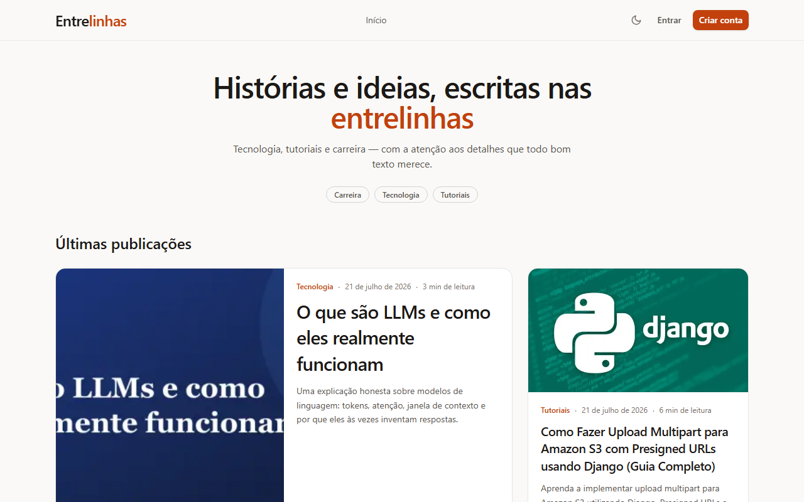<br>_Últimos posts, trending e filtro por categoria — SSR/ISR, sem spinner no cliente_ | <br>_Sumário gerado automaticamente, reações, seguir o autor_ |

|                                          Página de categoria                                          |                                        Perfil do autor                                        |
| :----------------------------------------------------------------------------------------------: | :------------------------------------------------------------------------------------------: |
| <br>_Todo post daquela categoria, com botão de seguir próprio_ | 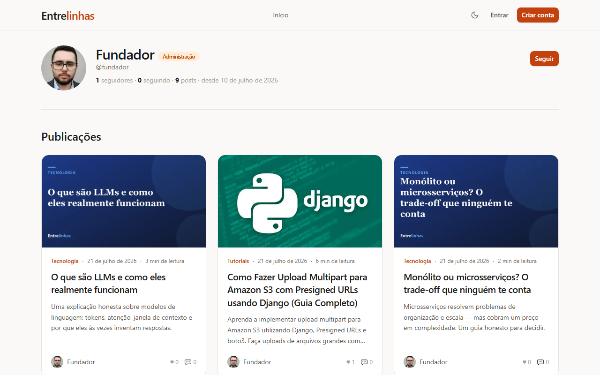<br>_Perfil público: selo de papel, seguidores, posts publicados_ |

### Autenticação, incluindo recuperação de senha feita do zero

|                                          Login                                          |                                        Registro                                        |
| :----------------------------------------------------------------------------------------------: | :------------------------------------------------------------------------------------------: |
| 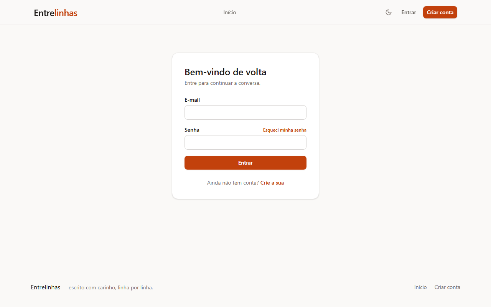<br>_Refresh token em cookie `httpOnly` — o access token nunca passa pelo `localStorage`_ | 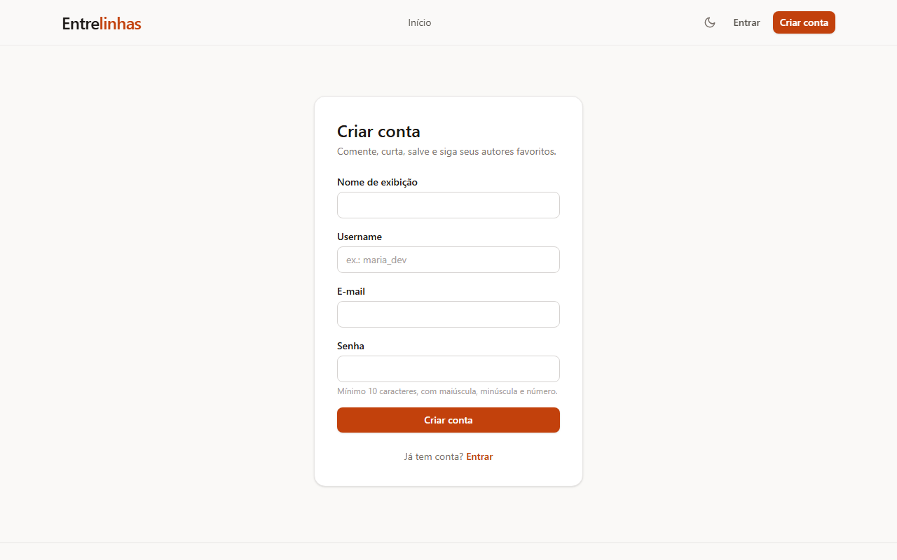<br>_Política de senha aplicada igual no cliente e no servidor_ |

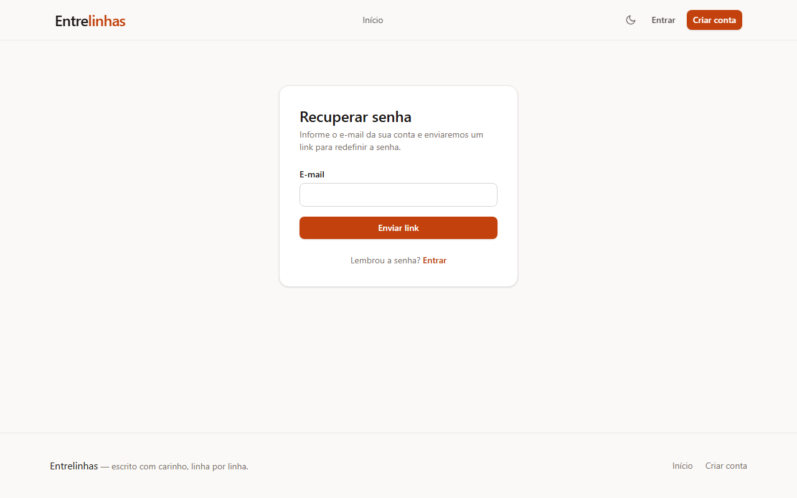
_Sempre a mesma resposta genérica, o e-mail existindo ou não — ver [Decisões de engenharia](#decisões-de-engenharia-que-valem-a-pena-mencionar)_

### Notificações e segurança da conta

|                                          Notificações                                          |                                        Sessões ativas                                        |
| :----------------------------------------------------------------------------------------------: | :------------------------------------------------------------------------------------------: |
| 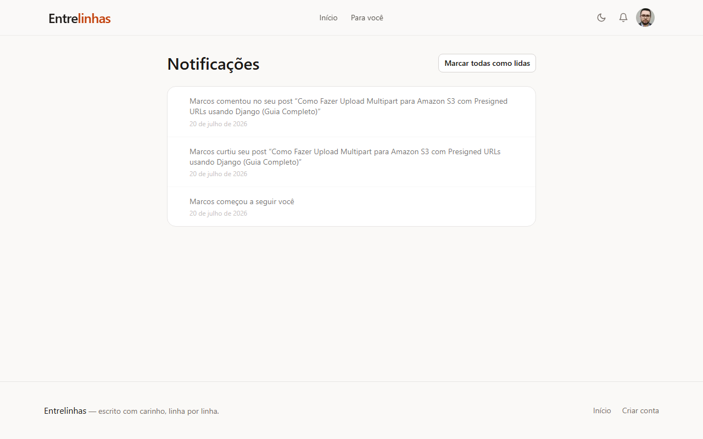<br>_Realtime via Supabase, cai pra polling automaticamente_ | 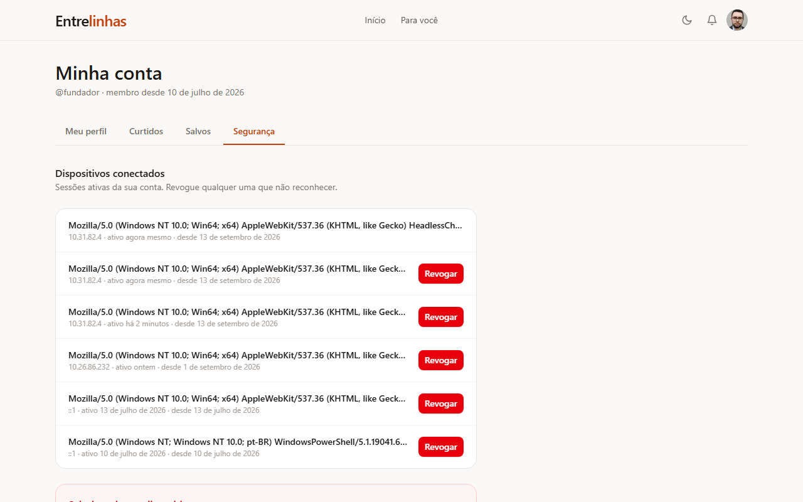<br>_Todo dispositivo que já logou — revoga um por um_ |

### O CMS em `/admin`

|                                          Editor de post (Tiptap)                                          |                                        Lista de posts                                        |
| :----------------------------------------------------------------------------------------------: | :------------------------------------------------------------------------------------------: |
| 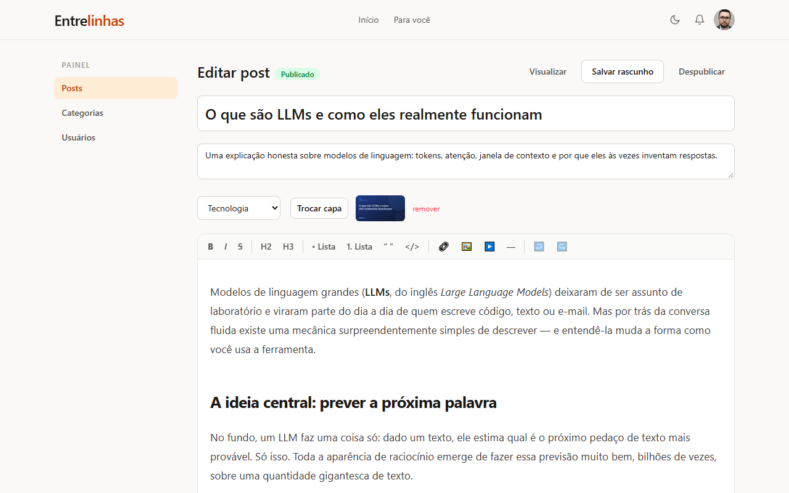<br>_Rich text, embed de imagem/vídeo, troca de capa — toda imagem reencodada no servidor_ | 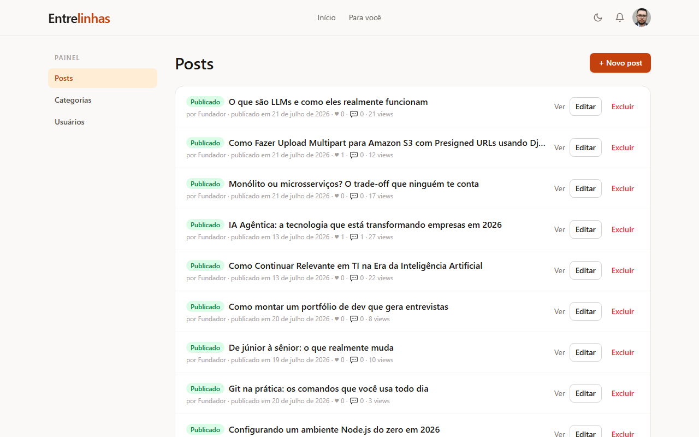<br>_Um REDATOR só vê e edita os próprios posts; um ADMIN vê de todo mundo_ |

|                                          Categorias                                          |                                        Papéis de usuário (RBAC)                                        |
| :----------------------------------------------------------------------------------------------: | :------------------------------------------------------------------------------------------: |
| 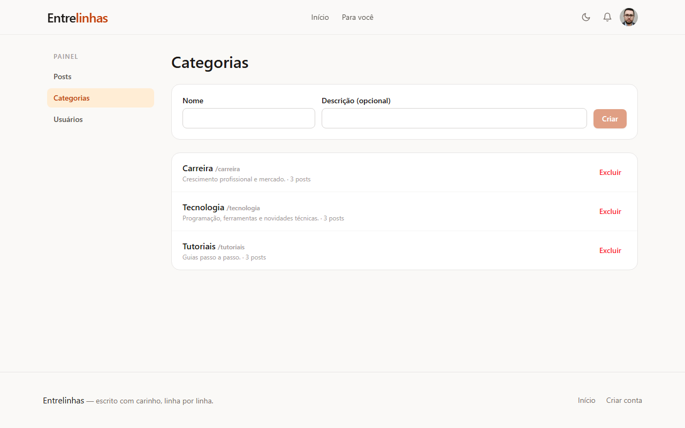<br>_Criar/excluir, contagem de posts por categoria_ | 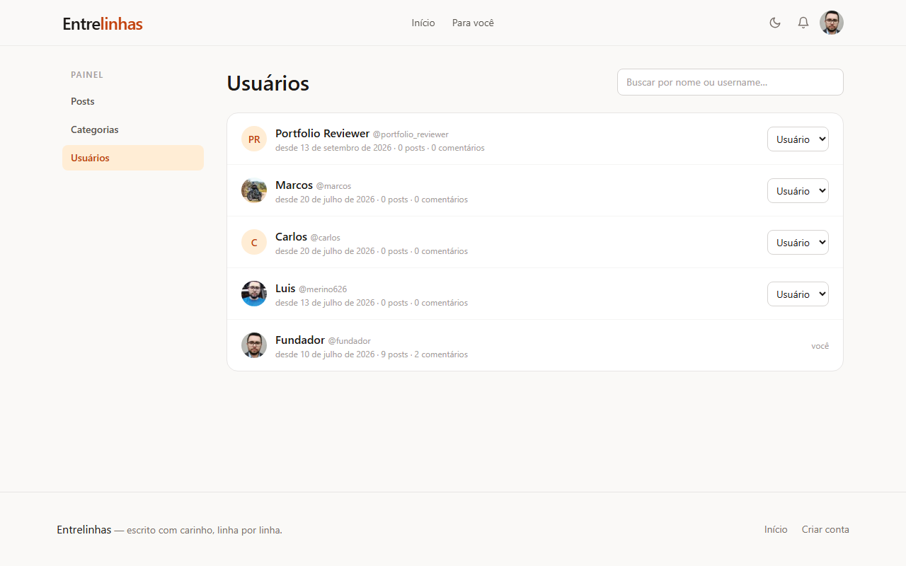<br>_Promover/rebaixar — repare que a própria linha do admin não tem seletor de papel_ |

_A interface em si é inteiramente em português — os screenshots acima são do app real, em produção, com dados reais (nenhum placeholder de seed/mock), capturados em [blog.merinodev.tech](https://blog.merinodev.tech)._

---

## Por que esse projeto existe

A maioria dos projetos de portfólio tipo CRUD para no "usuário loga e posta coisas". Eu quis construir a versão dessa ideia que aguenta as perguntas que um revisor focado em segurança faria: o que acontece se uma sessão é roubada? O último admin consegue se trancar pra fora da própria conta? O que acontece com um bucket tipo S3 (`post-media`) quando um post é excluído — o storage vaza silenciosamente pra sempre? O fluxo de recuperação de senha vaza se um e-mail tem conta ou não?

Entrelinhas é um deploy real, em três serviços separados (Vercel + Render + Supabase), que eu desenhei pra responder "sim, eu pensei nisso" pro máximo possível dessas perguntas, sem deixar de entregar um blog genuinamente agradável de ler e escrever — RBAC com três papéis, comentários em thread com reações, um CMS de rich text, notificações em tempo real, e um fluxo de recuperação de senha que eu adicionei e testei contra o meu próprio projeto Supabase de produção enquanto escrevia este README (a seção de [decisões de engenharia](#decisões-de-engenharia-que-valem-a-pena-mencionar) conta a história).

## O que ele realmente faz

1. Qualquer pessoa lê posts publicados, filtra por categoria, segue um autor ou categoria, e busca por texto completo — sem precisar de conta.
2. Um **USER** registrado comenta (com respostas e @menções), reage 👍/👎 a comentários, curte/salva posts e segue autores/categorias — cada ação dispara uma notificação agregada e com anti-flood pro destinatário.
3. Um **REDATOR** ganha acesso ao `/admin` pra criar, editar e publicar **os próprios** posts, num editor rich-text baseado em Tiptap, com autosave e preview de rascunho ao vivo.
4. Um **ADMIN** tem tudo que um REDATOR tem, mas sobre os posts de qualquer autor, além de gerenciar categorias e promover/rebaixar outros usuários — exceto a si mesmo, de propósito.
5. Toda conta pode revisar os próprios dispositivos logados e revogar um individualmente, ou todos de uma vez, em `/perfil`.
6. Esquecer a senha não exige um admin resetando a conta na mão: `/recuperar-senha` dispara um e-mail de recuperação de verdade pelo Supabase Auth (GoTrue), e `/redefinir-senha` consome o token de recuperação (uso único) pra definir uma nova.

---

## Funcionalidades

### ✍️ CMS
- Editor rich-text Tiptap: títulos, listas, blocos de código com syntax highlighting, embed de imagem/vídeo (YouTube/Vimeo na allow-list), upload por arrastar-e-soltar ou colar.
- Autosave mais uma máquina de estados explícita ("salvar rascunho" / "publicar" / "despublicar"), com uma rota de preview de rascunho ao vivo que só o próprio autor (ou um admin) pode abrir.
- Sumário gerado automaticamente a partir da própria estrutura de títulos do post, exibido ao lado do artigo.
- Toda imagem enviada é decodificada e **reencodada** em WebP no servidor (ver [Modelo de segurança](#modelo-de-segurança)) — não é só uma validação por extensão de arquivo.

### 👥 Comunidade
- Comentários em thread com respostas via @menção, reações 👍/👎, intervalo mínimo entre comentários e limite de links por comentário (anti-spam).
- Curtidas, salvos ("ler depois") e follows — tanto de autores quanto de categorias.
- Busca full-text (Postgres `tsvector` + `websearch_to_tsquery`, ranqueada por `ts_rank`) e um feed de trending, ambos renderizados no servidor.
- Sino de notificações em tempo real via Supabase Realtime (com RLS restrito ao destinatário), com fallback automático pra polling se a anon key não estiver configurada no frontend.

### 🔑 Auth & contas
- Supabase Auth (GoTrue) por trás de tudo, mas o frontend nunca fala com ele diretamente — toda chamada de auth passa pela API NestJS, então as chaves anon/service-role nunca chegam ao navegador para fins de autenticação.
- Refresh token num cookie `httpOnly`, com `SameSite` apropriado, restrito a `/api/v1/auth`; o access token vive só em memória no cliente.
- Fluxo completo de recuperação de senha: `/auth/forgot-password` e `/auth/reset-password`, com o token de recuperação viajando no corpo da requisição — nunca como header `Bearer` (ver [por quê](#decisões-de-engenharia-que-valem-a-pena-mencionar)).
- Rastreio de sessão por dispositivo, com revogação individual ou "em todo lugar", apoiado numa blacklist de sessão real checada a cada requisição.
- Exclusão de conta self-service (LGPD) que reverifica a senha antes e limpa arquivos do Storage que o cascade do banco não alcança.

### 🛡️ RBAC & ferramentas de admin
- Três papéis — USER, REDATOR, ADMIN — aplicados por um `RolesGuard` que lê metadados de `@Roles()`, não checagens `if (user.role === ...)` espalhadas pelo código.
- Duas regras de anti-lockout independentes: um admin não pode alterar o próprio papel, e o último admin restante não pode excluir a própria conta.
- `/admin/usuarios`, `/admin/categorias`, e uma lista de posts filtrada por papel (REDATOR só vê os próprios; ADMIN vê de todo mundo).

---

## Stack

| | |
|---|---|
| **NestJS 11 + Prisma 6** | API REST versionada (`/api/v1`), guards de RBAC, rate limiting, DTOs com `class-validator`. |
| **Next.js 15 (App Router)** | Site público (SSR/ISR + SEO: sitemap, RSS, imagens OG) e o CMS em `/admin`, no mesmo deploy. |
| **Supabase** | Postgres (via Prisma), Auth (GoTrue — único cliente da API), Storage (buckets públicos `post-media`/`avatars`), Realtime (notificações). |
| **Tiptap** | O editor rich-text do CMS — títulos, blocos de código com `lowlight`, embed de imagem/vídeo. |
| **Tailwind CSS 4** | Estilização, com um modo escuro feito à mão (ver [screenshots](#screenshots)). |
| **Jest** | Testes unitários pra superfície de auth/RBAC — guards, a estratégia JWT, o serviço de recuperação de senha. |
| **pnpm workspaces** | Monorepo: `apps/api`, `apps/web`, `packages/shared` (tipos compartilhados entre os dois). |

---

## Arquitetura

Três serviços hospedados separadamente, conectados por variáveis de ambiente — não existe Supabase Edge Function nem acesso só-por-RLS; toda leitura/escrita passa pela API NestJS usando a chave `service_role`, com RLS do Postgres habilitado em toda tabela como defesa em profundidade.

```
┌─────────────┐        ┌──────────────────┐        ┌───────────────────────────┐
│   Vercel    │──HTTP─▶│      Render       │──SQL──▶│         Supabase          │
│  apps/web   │◀──────│     apps/api      │◀──────│  Postgres · Auth · Storage │
│ (Next.js)   │  JSON  │    (NestJS)       │        │  (post-media / avatars)   │
└─────────────┘        └──────────────────┘        └───────────────────────────┘
```

- **Supabase** é só a camada de dados: Postgres, Auth (o GoTrue emite os JWTs que a API valida) e Storage. O frontend guarda uma anon key só pro canal Realtime de notificações — toda escrita, e toda chamada de auth, passa pela API.
- **Render** hospeda a `apps/api` como um processo Node de longa duração (não serverless) — precisa de estado de rate-limit em memória e comportamento estável pro cookie de refresh token.
- **Vercel** hospeda a `apps/web` — SSR/ISR padrão do Next.js pras páginas públicas, CMS renderizado no cliente sob `/admin`.

---

## Decisões de engenharia que valem a pena mencionar

**O token de recuperação de senha nunca viaja como header `Bearer`.** O GoTrue do Supabase emite um access token real e assinado pro fluxo de recuperação por e-mail — e esse token passaria pelo `JwtAuthGuard` da própria API como qualquer token de sessão normal passaria, já que é um JWT legitimamente assinado pra um usuário real. Mandá-lo como `Authorization: Bearer` significaria que um link de recuperação vazado (encaminhado por engano, parado num cliente de e-mail) poderia autenticar como aquele usuário em *qualquer* endpoint, não só na troca de senha. A correção: `POST /auth/reset-password` recebe o token como um campo simples no corpo JSON; a API repassa ele pro endpoint `/user` do próprio GoTrue só para esse propósito, e nunca o anexa a `req.user`.

**Duas regras de anti-lockout independentes, não uma.** `updateRole` recusa deixar um admin mudar o próprio papel; `deleteMe`, separadamente, recusa deixar o último admin restante excluir a própria conta (ele conta outros admins primeiro). Nenhuma checagem depende da outra — um admin se rebaixando e um admin se excluindo são modos de falha diferentes, e bugs de RBAC são exatamente do tipo barato de prevenir e caro de explicar depois.

**Notificações se agregam em vez de inundar.** Uma enxurrada de curtidas num post popular não cria N linhas — `NotificationsService.emit` procura uma notificação *não lida* do mesmo tipo/entidade dentro de uma janela de 24h e, se existir, incrementa um contador e funde o novo autor (deduplicado, limitado a 3 exibidos) em vez de inserir uma linha nova. O mesmo autor curtindo/descurtindo/curtindo de novo não infla o contador, e ninguém nunca é notificado das próprias ações.

**Toda imagem enviada é decodificada e reencodada, não só "validada."** `sharp(buffer, { failOn: 'error', limitInputPixels: 40_000_000 }).rotate().resize(...).webp(...)` roda em todo upload — capas de post e avatares igualmente. Isso não é uma checagem de MIME type: decodificar-e-reencodar é o que de fato derrota um arquivo poliglota (um JPEG válido que também é um outro-formato válido) e remove metadados EXIF/GPS, porque os bytes de saída são gerados do zero a partir dos pixels decodificados, não uma cópia da entrada com o cabeçalho trocado.

**A busca full-text é Postgres de verdade, não um `LIKE '%query%'`.** Os posts têm uma coluna `tsvector` gerada (`search_vector`); o caminho de busca usa `websearch_to_tsquery('portuguese', ...)` (pra usuários poderem digitar buscas naturais, não sintaxe de tsquery) ranqueada por `ts_rank`, como uma query raw parametrizada no meio do resto do código baseado em Prisma — a única exceção deliberada a "nenhum SQL cru," porque o Prisma não modela operadores de `tsvector`.

**A limpeza do Storage é explícita, porque o cascade do banco não alcança ele.** Excluir um post faz cascade nas linhas do Postgres numa boa, mas os arquivos de verdade no Supabase Storage (`post-media`) não vivem numa relação de chave estrangeira com nada — são objetos num bucket. Todo caminho que remove ou substitui um post, uma capa ou um avatar também chama explicitamente `removeFileByPublicUrl`/`removeFiles` contra o Storage; a exclusão de conta coleta todo caminho de mídia numa transação *antes* de excluir o usuário no GoTrue (cujo cascade, senão, levaria junto as linhas do banco que apontam pra esses arquivos).

**Segurança de dependências é processo, não correção pontual.** Tornar esse repositório público significou rodar `pnpm audit` pela primeira vez em um tempo — voltou com 28 achados (20 high). A maioria era de dependências transitivas de ferramental que só roda em build (`@nestjs/cli`, o CLI do `prisma`), nunca no processo em produção; corrigidas com `pnpm.overrides` restrito ao pacote pai exato (`"minimatch@3>brace-expansion"`, não um `"brace-expansion"` genérico), pra um patch de um consumidor não forçar silenciosamente uma major incompatível em outro consumidor ainda numa `minimatch` mais antiga. As que *de fato* importavam — `sharp` (reencode de imagem, descrito acima), `sanitize-html` (um advisory de XSS bem na biblioteca que sanitiza o HTML de posts/comentários enviado por usuário), e o próprio `next` (um SSRF em Server Actions) — foram atualizadas diretamente. Uma (`@tiptap/core`, um advisory moderado de prototype pollution só alcançável pelo editor, que já é restrito a REDATOR/ADMIN) foi deixada de propósito: corrigi-la significava um salto de major version na árvore inteira de dependências do Tiptap, e uma migração de verdade merece sua própria mudança, não escondida dentro de um patch de segurança.

---

## Modelo de segurança

| Camada | Como é aplicado |
|---|---|
| **Senhas & sessões** | Supabase Auth (hash, rotação de refresh com detecção de reuso). O access token vive só em memória no navegador; o refresh token fica num cookie `httpOnly` restrito a `/api/v1/auth`. |
| **Recuperação de senha** | O token viaja no corpo da requisição, nunca como `Bearer` — ver [decisões de engenharia](#decisões-de-engenharia-que-valem-a-pena-mencionar). `forgot-password` sempre retorna a mesma resposta, o e-mail existindo ou não. |
| **Revogação de sessão** | Todo login é registrado (`user_sessions`); revogar um coloca seu `session_id` numa blacklist — o JWT correspondente é rejeitado já na próxima requisição, e seu refresh é bloqueado. |
| **RBAC** | `RolesGuard` sobre metadados de `@Roles()`, não checagens de papel inline. Duas regras de anti-lockout independentes (auto-mudança de papel, auto-exclusão do último admin) — ver acima. |
| **XSS** | O HTML do editor passa por uma allow-list (`sanitize-html`) no servidor antes de ser salvo; iframes restritos a YouTube/Vimeo; URLs `javascript:` e handlers `on*` são removidos. Comentários renderizam como texto puro via React, nunca `dangerouslySetInnerHTML`. |
| **Injeção SQL** | Prisma (queries parametrizadas) em tudo, exceto a única query raw parametrizada de busca full-text — nenhum SQL concatenado por string em lugar nenhum. |
| **Uploads** | Toda imagem decodificada e reencodada em WebP (valida pelos pixels reais, destrói payloads poliglotas, remove EXIF/GPS). Objetos órfãos no Storage são explicitamente excluídos ao substituir/remover. |
| **CSRF** | Rotas que dependem só de cookie (`refresh`, `logout`) ficam atrás de um `OriginCheckGuard` com allow-list de `WEB_ORIGIN`; toda outra rota exige um token `Bearer` que um site de terceiros não consegue forjar. |
| **Rate limiting** | 120 req/min global por IP; login/registro/esqueci-senha/redefinir-senha 5/min; comentários 6/min; reações/follows 30/min; uploads 20/min. |
| **Transporte** | `helmet` + CSP, `trust proxy` pro IP real do cliente atrás do Render, CORS restrito a `WEB_ORIGIN`. |
| **Dependências** | `pnpm audit` limpo em todo pacote que roda em produção; a única exceção aceita está documentada, não silenciosa (ver acima). |

---

## Estrutura do projeto

```
apps/
├── api/                       # NestJS 11 + Prisma 6
│   ├── src/
│   │   ├── auth/               # login/registro/refresh, recuperação de senha, estratégia JWT
│   │   ├── common/guards/      # RolesGuard, JwtAuthGuard, OriginCheckGuard
│   │   ├── posts/               # CRUD, busca full-text, trending, posts relacionados
│   │   ├── comments/             # comentários em thread, reações, anti-spam
│   │   ├── notifications/        # emissão agregada/anti-flood + Realtime
│   │   ├── media/                 # pipeline de reencode com sharp (uploads)
│   │   ├── users/                  # perfil, sessões, mudança de papel (RBAC), exclusão LGPD
│   │   └── supabase/                # cliente REST do GoTrue, cliente admin do Storage
│   ├── prisma/migrations/
│   └── scripts/                # seed (admin + categorias), seed de conteúdo/capas
│
├── web/                        # Next.js 15 (App Router)
│   ├── app/
│   │   ├── admin/               # CMS: posts, categorias, usuários — restrito por papel no cliente também
│   │   ├── (rotas públicas)/       # /, /blog/[slug], /categoria/[slug], /autor/[username]
│   │   ├── login, registro/       # + recuperar-senha, redefinir-senha
│   │   └── perfil, notificacoes/
│   └── lib/                      # cliente de API (refresh de sessão automático), contexto de auth, realtime
│
└── packages/shared/            # tipos/limites compartilhados entre api e web

docs/screenshots/              # tudo que está embutido neste README
```

---

## Rodando localmente

```bash
pnpm install
```

### 1. Chaves do Supabase

Copie `apps/api/.env.example` → `apps/api/.env` e `apps/web/.env.example` → `apps/web/.env.local`, depois preencha a anon key, a chave `service_role` (só na API, nunca no frontend), e as connection strings pooled/direct do Postgres, tudo no dashboard do seu projeto Supabase.

```bash
pnpm --filter @blog/api run prisma:deploy
pnpm --filter @blog/api run seed     # buckets de storage + primeiro admin + categorias
```

Defina `SEED_ADMIN_EMAIL`/`SEED_ADMIN_PASSWORD` antes de rodar o seed — sem eles o script cai numa senha padrão previsível de desenvolvimento e imprime um aviso.

### 2. Rodar

```bash
pnpm dev          # API na :3001, web na :3000
pnpm dev:api      # docs do Swagger em http://localhost:3001/api/docs
```

### 3. Testes

```bash
pnpm --filter @blog/api run test
```

---

## Deploy

Render (`apps/api`) e Vercel (`apps/web`) referenciam a URL um do outro, então a ordem prática é: implantar a API, implantar o frontend apontando pra ela, depois setar `WEB_ORIGIN` no Render pra URL real do frontend. Até esse último passo, o frontend carrega mas toda chamada à API falha por CORS.

Um link de recuperação de senha é montado a partir de `WEB_ORIGIN` e passado ao Supabase como `redirect_to` — mas o GoTrue cai silenciosamente de volta pra própria **Site URL** configurada no dashboard se esse endereço também não estiver em **Authentication → URL Configuration → Redirect URLs**. Os dois precisam ser configurados explicitamente; é um passo de cinco minutos no dashboard que as próprias notas de deploy deste projeto existem pra eu não esquecer de novo.

---

## Roadmap

SMTP customizado pros e-mails de Auth (o mailer embutido do Supabase tem um teto de poucos e-mails/hora — ótimo pra desenvolvimento, não pro volume real de cadastro/recuperação), migração pro Tiptap v3 (hoje travado na v2 em toda a árvore de dependências — ver [decisões de engenharia](#decisões-de-engenharia-que-valem-a-pena-mencionar)), Turnstile/captcha no registro, moderação de comentários dedicada no painel admin, exportação de dados (LGPD/GDPR).

---

## Licença

Distribuído sob a [Licença MIT](LICENSE) — © 2026 Luis Eduardo.

<div align="center">

Feito por [@merino626](https://github.com/merino626).

</div>
